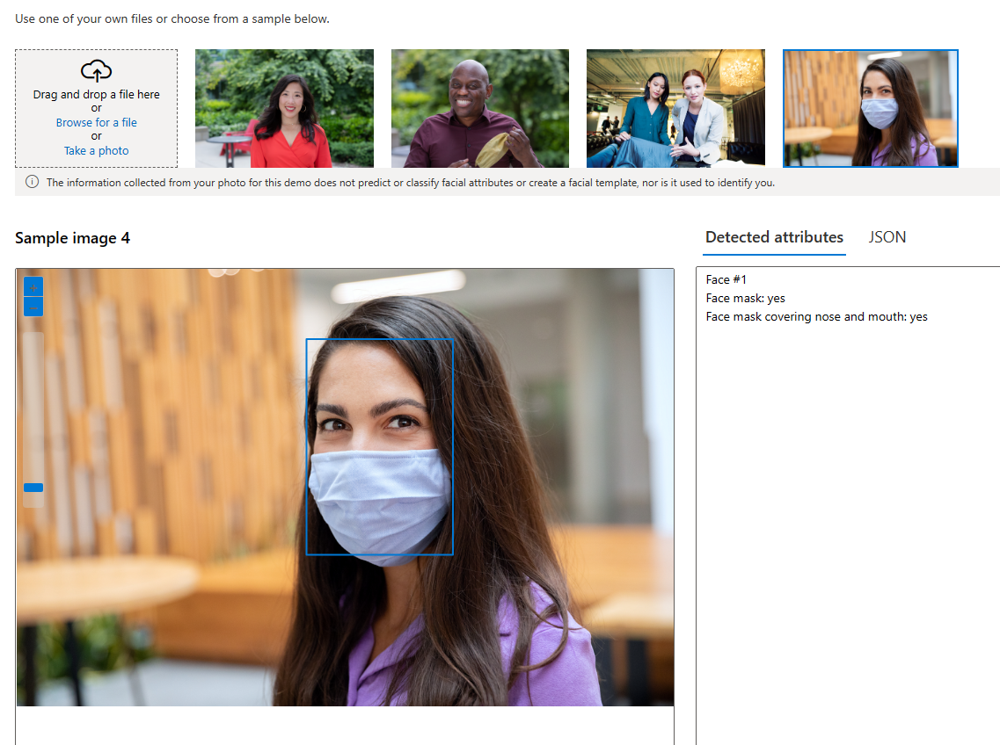
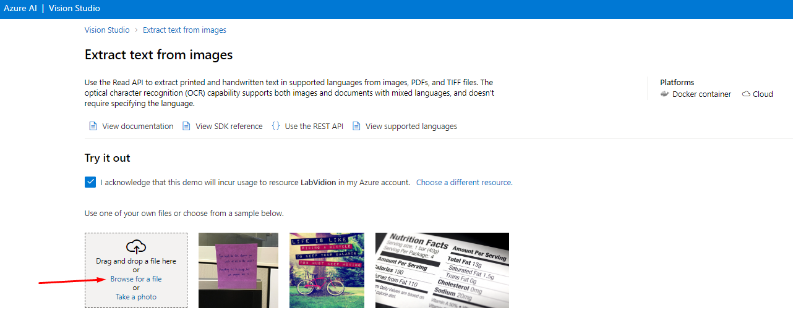

<h1>
    
     Reconhecimento Facial e transformação de imagens em Dados
</h1>

## Add captions to imagens
Através deste recurso a Inteligência Artificial descreve o que esta presente na imagem, possibilitando assim que deficientes visuais saibam o que esta presente na foto ou video.

01 - Dentro do Vision Studiona guia *Image analysis* clique na opção Add captions to imagens:   
 

...

02 - O recurso trás algumas imagens de exemplo para que você realize testes do serviço e até mesmo a possibilidade de realizar upload de uma foto sua e ter a descrição, no meu caso adicionei uma foto minha para testes e o serviço me retorna a descrição do que identificou na imagem:   
 

...

## Optical character recognition
Através deste recurso a Inteligência Artificial extrai o texto que conseguir identificar na imagem, extremamente util para o escaneamento de documentos e notas:

01 - Dentro do Vision Studiona guia *Optical character recognition* clique na opção Extract text from images:   
 

...

02 - O recurso trás algumas imagens de exemplo para que você realize testes do serviço e até mesmo a possibilidade de realizar upload de uma , logo após o upload todo o texto contido na imagem aparece a direita:   
 

...

## Considerações Finais

 Esses recursos têm várias utilidades práticas. O recurso de detecção e descrição de imagens aprimora sistemas de segurança, permitindo que identifiquem rostos e detectem pessoas que passam em frente às câmeras. Além disso, o reconhecimento facial também é possível, facilitando a identificação de indivíduos conhecidos. Já o recurso de extração de texto é valioso para empresas. Ele ajuda a gerenciar arquivos antigos, digitalizando e armazenando informações de notas. Isso simplifica a manutenção dos arquivos e agiliza o acesso a esses dados quando necessário.

